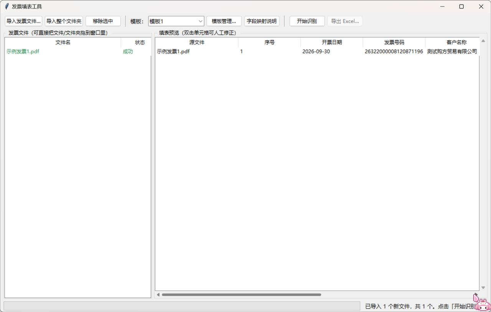

# 发票填表工具（Invoice Filler）

批量识别**数电票（电子发票）**PDF / 图片 / 扫描件 → 按 Excel 模板表头自动填表 → 预览人工修正 → 导出保留模板样式的 Excel。



## 特性

- **批量导入**：多选文件 / 整个文件夹 / 从资源管理器拖拽到窗口任意位置
- **双通道识别**：PDF 自带文字层时直接精确提取（快且准）；图片和扫描件自动走本地离线 OCR
  （RapidOCR，无需任何 API 密钥、数据不出本机）
- **模板化字段映射**：表头 ↔ 发票字段的映射是 JSON 配置（`templates/*.json`），内置"模板1"；
  在界面里导入新的 Excel 表头即可自动匹配生成新模板，主流程代码零改动
- **导出保真**：完整保留模板的表头顺序、字体样式与合并单元格；写入位置自动顺延到第一个空行
- **健壮**：单个文件识别失败不中断批量；缺失字段留白并加单元格批注 + 「处理报告」工作表；
  预览表格双击即可人工修正，修正值优先于识别值
- **字段映射说明**：每次导出附带一份《字段映射说明.md》，逐列说明表头与发票原始内容的对应关系

## 环境要求

- Windows 10 / 11（64 位）
- Python 3.10+（开发环境为 3.12）

## 快速开始

```bat
git clone <仓库地址> 发票填表工具
cd 发票填表工具
python -m venv .venv
.venv\Scripts\pip install -r requirements.txt -i https://pypi.tuna.tsinghua.edu.cn/simple
.venv\Scripts\python main.py
```

也可以双击 `启动.bat`（自动使用虚拟环境）。

命令行批处理（免界面）：

```bash
python tools/cli_check.py 发票1.pdf 发票2.png --out 填表结果.xlsx
```

## 打包成免安装 exe

```bat
双击 打包exe.bat
```

产物 `dist\发票填表工具.exe` 为单文件、免安装，可直接发给其他 Windows 电脑使用
（目标机器无需安装 Python 或任何依赖）。注意：首次运行如有 SmartScreen 提示，
选"更多信息 → 仍要运行"；exe 请放在可写目录；不要以管理员身份运行（会禁用拖放）。

## 模板机制（可扩展）

模板即 JSON 配置，描述来源工作簿、表头行、每列的位置（列字母 / 合并跨度）与映射的规范字段：

```json
{"header": "客户名称", "col": "E", "colspan": 3, "field": "buyer_name",
 "note": "「购买方信息」栏 -「名称」"}
```

- 界面「模板管理 → 从 Excel 导入新模板」：程序按字段别名表自动匹配每个表头，
  在映射编辑器中确认/调整后即保存为新模板，无需改代码；
- 匹配不上的列默认留白（发票上没有对应内容，如「交易模式」）；
- 新增规范字段：在 `invoice_filler/fields.py` 的字段注册表中加一条别名即可。

内置规范字段覆盖：发票号码/代码、开票日期、购买方/销售方名称与税号、明细（品名/规格/单位/数量/单价）、
合计金额、税率、税额、价税合计（大小写）、备注、开票人、购销双方开户行与账号等。

## 项目结构

```
main.py                  程序入口（依赖缺失时弹窗提示）
ui/app.py                桌面界面（tkinter，拖拽导入 / 预览 / 修正 / 模板管理）
invoice_filler/
  fields.py              规范字段注册表 + 表头别名自动匹配
  reader.py              PDF 文字层 / OCR 词块读取（中文路径安全）
  parser.py              数电票解析器（行聚合 + 锚点定位，兼容 OCR 粘连词块）
  template.py            模板 JSON 加载/保存/从 xlsx 自动生成映射
  exporter.py            Excel 导出（保留模板样式 + 处理报告 + 防覆盖）
  report.py              字段映射说明生成
templates/               模板配置（运行时生成，template1 内置种子在 invoice_filler/）
tools/cli_check.py       命令行批处理
tools/smoke_test.py      自检脚本（自生成合成发票，可复现示例输出）
示例模板/  示例输出/       由 tools/smoke_test.py 的合成发票生成的可复现示例
```

自检（需先装好依赖）：

```bash
python tools/smoke_test.py
```

## 声明

本工具仅用于提升发票信息整理效率，不校验发票真伪；请自行确保发票数据的处理与保存符合当地法律法规。
发票识别仅支持数电票版式，其他版式会标注"版式不支持"并留空。

## 许可证

[](LICENSE)

Apache-2.0 © 2026 池糖

需要功能更新可发邮箱：jiangzhige666@gmail.com / 1713136802@qq.com

没人能一直陪我，但是工作一直缠着我。爱你，老工 ❤️
